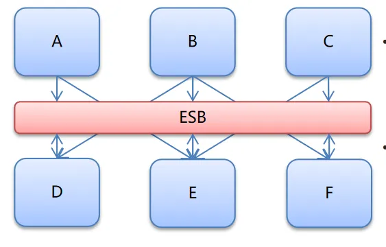

## 一、大型互联网项目架构目标

- **高性能**：提供快速的访问体验。
- **高可用**：网站服务一直可以正常访问。
- **可伸缩**：通过硬件增加/减少，提高/降低处理能力。
- **高可扩展**：系统间耦合低，方便的通过新增/移除方式，增加/减少新的功能/模块。

## 二、SOA架构和微服务架构

### 1. SOA架构（面向服务架构）

SOA：（Service-Oriented Architecture，面向服务的架构）是一个组件模型，它将应用程序的不同功能单元（称为服务）进行拆分，并通过这些服务之间定义良好的接口和契约联系起来。

ESB：(Enterparise Servce Bus) 企业服务总线，服务中介。主要是提供了一个服务于服务之间的交互。ESB 包含的功能如：负载均衡，流量控制，加密处理，服务的监控，异常处理，监控告急等等。

### 2. 微服务架构

微服务架构是在 SOA 上做的升华，微服务架构强调的一个重点是“业务需要彻底的组件化和服务化”，原有的单个业务系统会拆分为多个可以独立开发、设计、运行的小应用。这些小应用之间通过服务完成交互和集成。

微服务架构 = 80%的SOA服务架构思想 + 100%的组件化架构思想 + 80%的领域建模思想。

**特点：**
- 服务实现组件化：开发者可以自由选择开发技术。也不需要协调其他团队。
- 服务之间交互一般使用REST API。
- 去中心化：每个微服务有自己私有的数据库持久化业务数据。
- 自动化部署：把应用拆分成为一个一个独立的单个服务，方便自动化部署、测试、运维。

## 三、服务框架 - SpringCloud 和 Dubbo

### 1. 两者的区别

- 初始定位不同：SpringCloud定位为微服务架构下的一站式解决方案；Dubbo 是 SOA 时代的产物，它的关注点主要在于服务的调用和治理
- 生态环境不同：SpringCloud依托于Spring平台，具备更加完善的生态体系；而Dubbo一开始只是做RPC远程调用，生态相对匮乏，现在逐渐丰富起来。
- 调用方式：SpringCloud是采用Http协议做远程调用，接口一般是Rest风格，比较灵活；Dubbo是采用Dubbo协议，接口一般是Java的Service接口，格式固定。但调用时采用Netty的NIO方式，性能较好。
- 组件差异比较多，例如SpringCloud注册中心一般用Eureka，而Dubbo用的是Zookeeper

### 2. 两者生态对比

| 功能           | Dubbo           | SpringCloud                           |
| -------------- | --------------- | ------------------------------------- |
| 服务注册中心   | Zookeeper       | Eureka（主流）、Consul、Zookeeper     |
| 服务调用方式   | RPC 基于 Dubbo协议 | REST API 基于 HTTP协议              |
| 服务监控       | Dubbo-Monitor   | Spring Boot Admin                     |
| 熔断器         | 不完善          | Spring Cloud Netflix Hystrix          |
| 服务网关       | 无              | Spring Cloud Netflix Zuul、Gateway    |
| 分布式配置     | 无              | Spring Cloud Config                   |
| 服务跟踪       | 无              | Spring Cloud Sleuth + Zipkin（常用）  |
| 数据流         | 无              | Spring Cloud Stream                   |
| 批量任务       | 无              | Spring Cloud Task                     |
| 信息总线       | 无              | Spring Cloud Bus                      |

Spring Cloud 的功能很明显比 Dubbo 更加强大，涵盖面更广，而且作为 Spring 的旗舰项目，它也能够与 Spring Framework、Spring Boot、Spring Data、Spring Batch 等其他 Spring 项目完美融合，这些对于微服务而言是至关重要的。

使用 Dubbo 构建的微服务架构就像组装电脑，各环节选择自由度很高，但是最终结果很有可能因为一条内存质量不行就点不亮了，总是让人不怎么放心，但是如果使用者是一名高手，那这些都不是问题。

## 四、服务间通信 - RPC 和 Feign

### 1. 什么是RPC

RPC（Remote Procedure Call Protocol）远程过程调用协议。

一个通俗的描述是：客户端在不知道调用细节的情况下，调用存在于远程计算机上的某个对象，就像调用本地应用程序中的对象一样。比较正式的描述是：一种通过网络从远程计算机程序上请求服务，而不需要了解底层网络技术的协议。

RPC是协议：既然是协议就只是一套规范，那么就需要有人遵循这套规范来进行实现。目前典型的RPC实现包括：Dubbo、Thrift、GRPC、Hetty等。

### 2. 什么是Feign

Feign是一个轻量级的Java库，专为简化HTTP API客户端调用而生。

通过动态代理和接口注解，Feign使得调用远程服务如同调用本地方法一样直观便捷。（可以认为Feign是RPC的一种）

它常用于Spring Cloud等微服务框架中，与服务发现、负载均衡等服务治理组件紧密集成，提供了一种声明式的HTTP客户端解决方案。

### 3. 两者对比

| 维度         | Feign           | RPC（gRPC为例）                   |
| ------------ | --------------- | --------------------------------- |
| 协议         | 基于 HTTP/REST  | 基于 HTTP/2 + 二进制协议          |
| 性能         | 性能一般，延迟高 | 高性能，低延迟                    |
| 序列化       | JSON，简单但数据大 | Protobuf，效率高                 |
| 开发体验     | 注解 + 接口，易用 | 需 IDL，学习成本高                |
| 跨语言支持   | Java 生态为主    | 多语言支持                        |
| 适用场景     | REST 接口、Web调用 | 内部高性能通信、跨语言调用       |

## 五、分布式锁 - Zookeeper 和 Redis

### 1. Zookeeper 概念

Zookeeper 是 Apache Hadoop 项目下的一个子项目，是一个树形目录服务。Zookeeper 翻译过来就是 动物园管理员，他是用来管 Hadoop（大象）、Hive(蜜蜂)、Pig(小猪)的管理员。简称zk

Zookeeper 是一个分布式的、开源的分布式应用程序的协调服务。

Zookeeper 提供的主要功能包括：
- 配置管理
- 分布式锁
- 集群管理

### 2. 两者对比

| 维度         | Zookeeper           | Redis                              |
| ------------ | ------------------- | ---------------------------------- |
| 一致性       | 强一致性，顺序性好  | 最终一致性，依赖超时机制           |
| 性能         | 较低，持久化操作较多 | 高，基于内存操作快                 |
| 可用性       | 高，节点崩溃自动释放锁 | 需哨兵或集群保障可靠性           |
| 适用场景     | 可靠性要求高的分布式协调 | 高并发场景下的快速加锁           |

Zookeeper 更可靠，适合严格一致性场景；Redis 性能优越，适合高并发环境。

现在很少使用 Zookeeper，主要原因是许多组件已经不再依赖它。例如，Kafka 已经不用了，RocketMQ 自带了 nameserver，注册中心也有了 Nacos。这样可以减少一个中间件，降低运维和维护成本。