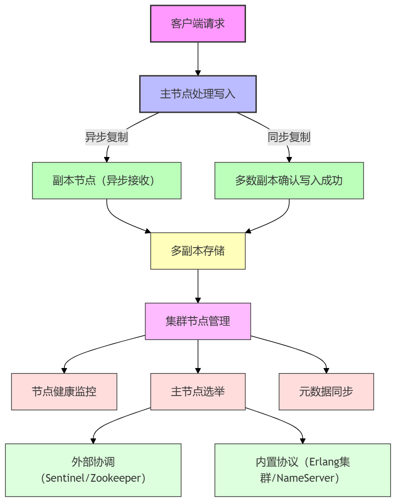

## 1. 集群有什么用？

单体系统受限于单台机器的 CPU、内存、网络等资源，无法支撑大量并发请求和数据处理。集群通过多台节点并行处理任务，把负载分散到各个节点上，整体处理能力成倍增加。
**核心价值**：突破单机瓶颈，让系统能够处理更多用户和数据，即提升整体吞吐量。

> 注：数据被分散到不同节点，各节点独立处理，不共享数据。

---

## 2. 集群需要解决的问题

CAP 理论描述分布式系统在一致性（C）、可用性（A）、分区容错性（P）三者中不可兼得。单体系统不涉及跨节点通信，不存在网络分区问题，可同时满足一致性和可用性。集群系统引入多节点和网络通信，可能出现网络分区，此时必须在一致性和可用性之间做权衡。

---

## 3. 节点间数据同步：保证一致性

节点间数据同步可分为两类：

* **异步复制（最终一致性）**：主节点写入后不等待副本确认即返回，副本异步接收或拉取数据。特点：写入延迟低、吞吐量高，允许短期不一致但最终数据一致。典型应用：镜像队列、Redis 主从复制、Kafka 异步副本。
* **同步复制（强一致性）**：主节点写入后必须等待集群多数副本确认才能返回。特点：严格保证数据一致性，即使部分节点宕机也不会丢数据，但写入延迟高，吞吐量下降。典型应用：Quorum 队列、Etcd/Raft、Zookeeper。

> 核心：异步复制追求吞吐量，允许最终一致性；同步复制保证强一致性，但牺牲性能。

---

## 4. 数据多副本存储：提高可用性

同一份数据在多个节点上存放，没有单点问题，提高可靠性。采用同步写入多副本会影响写入性能，异步写入多副本性能影响较小。
典型应用：RabbitMQ 镜像队列模式、Kafka 分区备份、Redis 分片集群。

---

## 5. 节点管理：提高分区容错性

网络分区可能导致脑裂（多个节点同时认为自己是主节点），出现数据冲突。集群通过**外部协调或内置协议**解决：

* 外部协调：独立服务管理节点状态、投票选举和元数据同步，如 Redis Sentinel、Kafka/Zookeeper。
* 内置协议：集群内部管理主节点选举、心跳监控和元数据同步，如 RabbitMQ Erlang 集群、RocketMQ NameServer。

通过这些机制，集群可以保证任意时刻只有一个主节点，避免脑裂，维持数据一致性和集群健康。

---

## 6. 常见中间件集群实践对比

| 中间件      | 数据同步         | 数据备份                   | 节点管理            |
| -------- | ------------ | ---------------------- | --------------- |
| Redis 主从 | 异步 + backlog | RDB + AOF + 主从         | Sentinel 节点监控   |
| Kafka    | 异步 follower  | 多副本 partition          | Zookeeper 元数据管理 |
| RocketMQ | 异步/同步复制      | commit log + Broker HA | NameServer 节点管理 |
| RabbitMQ | Erlang 内置复制  | HA queue + 持久化队列       | Erlang 集群协议     |

---

## 7. 总结规律

* 数据同步决定一致性与性能：同步复制 → 强一致性但性能受限，异步复制 → 性能高但允许最终一致性。
* 数据冗余提高可用性：多副本、多节点备份能容忍单节点或部分节点故障，支持灾备和异地部署。
* 节点管理确保分区容错：主节点选举和脑裂防护是高可用集群核心，节点监控和元数据管理保证集群稳定。

---

## 8. 结语

完善的后端中间件集群设计核心是从**一致性、可用性、分区容错性**三个维度出发：节点间数据同步 → 保证一致性，数据冗余与多副本存储 → 提高可用性，节点管理与选举机制 → 提高分区容错性。理解并实现这三大原则，才能构建高性能、高可用、可扩展的分布式集群架构。

---