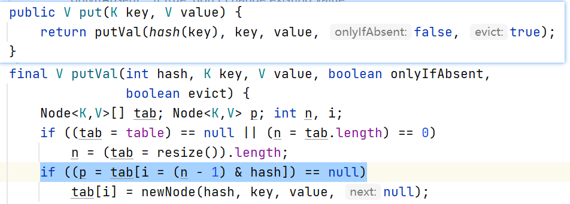
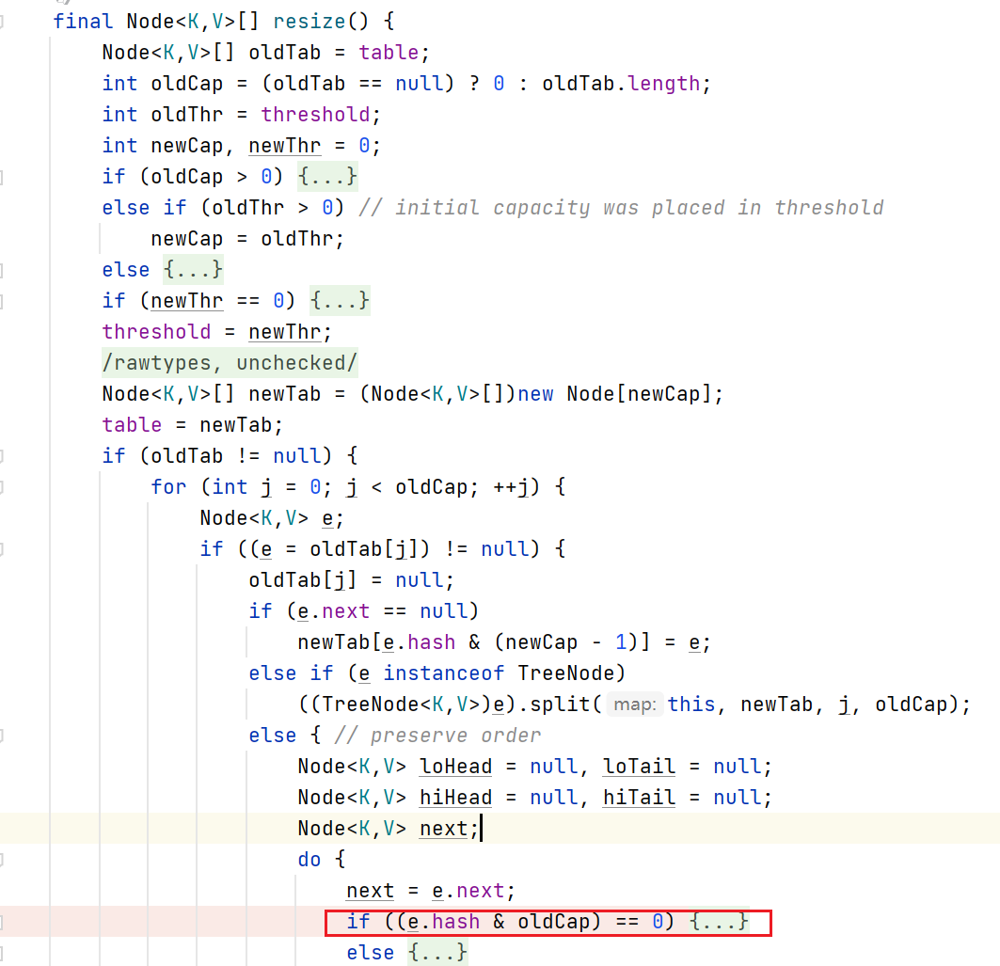

在 Java 开发中，HashMap 是最常用的数据结构之一。为什么要求容量必须是 2 的幂，以及如何使用位运算替代取模运算，是理解 HashMap 高性能设计的关键。

## 一、HashMap 的基本设计

HashMap 默认初始容量为 16（$2^4$）：

```java
static final int DEFAULT_INITIAL_CAPACITY = 1 << 4; // 16
```

加载因子默认是 0.75：

```java
static final float DEFAULT_LOAD_FACTOR = 0.75f;
```

当元素个数超过 `capacity × 0.75` 时触发扩容，每次容量变为原来的 2 倍。

**为什么加载因子是 0.75？**

- 如果加载因子过高（如 0.9），数组利用率提高，但冲突增多，链表或红黑树变长，查询效率下降；
- 如果过低（如 0.5），冲突减少，但空间浪费严重，扩容次数变多。

0.75 是时间复杂度与空间利用率之间的平衡点，因此成为默认值。

更关键的是：**容量必须是 2 的幂**。这是后面所有位运算优化成立的前提。

## 二、Hash 方法

源码中的 `hash` 方法如下：

```java
static final int hash(Object key) {
    int h;
    return (key == null) ? 0 :
           (h = key.hashCode()) ^ (h >>> 16);
}
```

核心逻辑是：

```
h ^ (h >>> 16)
```

HashMap 在计算数组索引时只使用低位。如果直接用 `hashCode()`，某些对象低位分布不均会导致冲突。JDK 采用"**高位扰动低位**"的方式，把高 16 位右移后与原值异或，让低位也包含高位信息，从而提高均匀性、降低碰撞概率。

此外，使用 HashMap 时必须同时重写 `equals()` 和 `hashCode()`，因为判断 key 是否相同是：先比较 hash，再调用 equals。

## 三、HashMap 的寻址算法



真正的性能优化，集中在这一行代码上：

```java
i = (n - 1) & hash;
```

其中，`n` 是桶数组长度（始终为 2 的幂），`i` 是最终数组索引。这一行代码的本质，是用位运算完成本该由取模运算完成的事情。

很多人会问：为什么不用更直观的 `hash % n`？

**关键就在于——n 必须是 2 的幂。**

当 $n = 2^k$ 时，它的二进制形式一定是：

```
10000...（只有最高位是 1）
```

那么 `n - 1` 就会变成：

```
01111...（低位全部为 1）
```

这个 `n - 1` 实际上就是一个"**低位掩码**"。

此时执行：

```
hash & (n - 1)
```

等价于：

- 把 hash 的高位全部清零
- 只保留最后 k 位

从数学角度看，$\text{hash} \mod 2^k$ 求的是一个数除以 $2^k$ 的余数；在二进制体系下，一个数除以 $2^k$ 的余数，恰好就是它的最后 k 位所表示的值。

因此，`(n - 1) & hash` 和 `hash % n` 在 n 为 2 的幂时，本质都是"取二进制的最后 k 位"，结果完全一致。

区别仅在于实现方式：

| 运算方式 | 说明 |
|---|---|
| `%` 取模 | 除法运算，硬件层面复杂度更高 |
| `&` 位运算 | CPU 直接按位计算，成本更低 |

所以 HashMap 通过"容量固定为 2 的幂"这个前提，把原本的取模运算优化成了位运算，在保证正确性的同时提升了性能。

## 四、扩容后重新计算索引



扩容时真正精妙的地方在于这段逻辑：

```java
if ((e.hash & oldCap) == 0)
    // 仍在原索引
else
    // 移动到 原索引 + oldCap
```

理解它的关键只有一句话：**扩容只是多判断了一个"新增的二进制位"**。

假设：

```
oldCap = 10000₂
newCap = 100000₂
```

扩容前索引计算用的是：

```
hash & 01111
```

扩容后索引计算变成：

```
hash & 11111
```

可以看到，新旧掩码的唯一区别，就是多了这一位：`10000`

也就是说——扩容前根本不会参与计算的这一位，现在开始参与索引计算了。

因此，元素是否需要移动，只取决于 `e.hash & oldCap`，本质就是在问：hash 在这一"新增位"上是 0 还是 1？

- 如果这一位是 **0**，那么新掩码和旧掩码算出来的结果完全相同，**索引不变**。
- 如果这一位是 **1**，那么**新索引 = 旧索引 + oldCap**。

**举例说明：**

```
hash = 10110110₂

判断新增位：
10110110
& 10000
--------
  10000   ≠ 0
```

该位为 1，因此元素移动到：新索引 = 旧索引 + oldCap

```
hash = 00110110₂

判断：
00110110
& 10000
--------
  00000
```

该位为 0，元素仍留在原索引位置。

整个过程既不重新计算 hash，也不重新取模，只是检查一个二进制位，就能确定元素去向。

这就是 HashMap 扩容依然能保持 O(n) 迁移成本的核心原因，也是它高性能设计中最精妙的一点。

## 五、总结

HashMap 的位运算优化可以概括为三点：

1. **容量必须是 2 的幂**，保证 `(n - 1)` 形成低位掩码
2. **使用 `(n - 1) & hash` 代替 `hash % n`**，提升索引计算性能
3. **扩容时通过判断 `(hash & oldCap)` 决定元素新位置**，无需重新计算 hash

这就是 HashMap 位运算设计背后的底层逻辑。