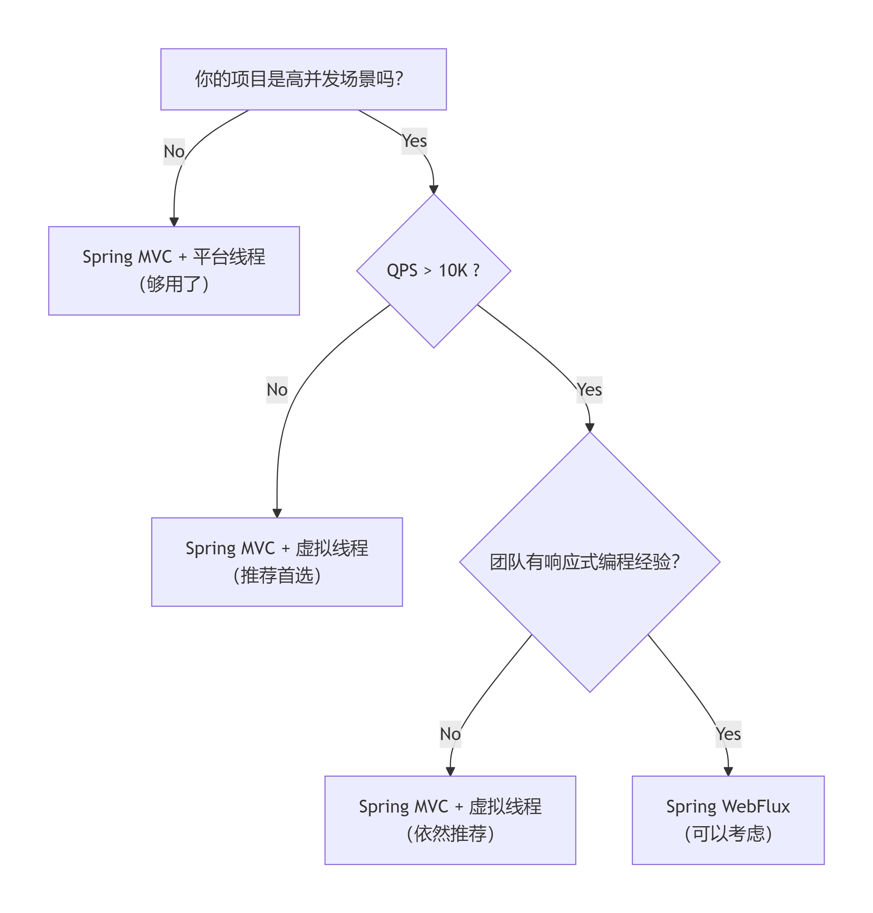

在 Java Web 开发领域，并发模型的演进是一个不断追求更高吞吐与更简单编程模型的过程。从早期 Servlet 的“一请求一线程”，到 Servlet 3.1 的异步非阻塞，再到 WebFlux 的响应式编程，每一次变革都提升了并发能力，却也增加了编程复杂度。而 Java 21 引入的虚拟线程，则让开发者终于可以同时获得高并发与直观的同步编程体验。

## 一、并发模型演进时间线

| 年份 | 技术/模型 | 编程模式 | 核心特点 | 并发能力 |
| :--- | :--- | :--- | :--- | :--- |
| 2005 | Servlet | 一请求一线程 | 线程昂贵，每个请求独占一个平台线程 | ~2,000 |
| 2013 | Servlet 3.1 | 异步 Servlet | NIO 支持，异步非阻塞 I/O | ~5,000 |
| 2017 | WebFlux | 响应式编程 | Mono/Flux，事件循环驱动 | ~50,000 |
| 2023 | Virtual Threads | 虚拟线程 | 百万级轻量线程，回归同步编程模型 | ~1,000,000 |

## 二、传统阻塞模型的瓶颈

以 Spring MVC 为代表的传统 Web 框架，采用的是“每个请求一个线程”（Thread-per-request）的模型。当一个请求到达时，Servlet 容器（如 Tomcat）会从线程池中分配一个线程来处理它。如果该请求需要执行 I/O 操作（如查询数据库、调用远程 API），线程就会被阻塞，直到 I/O 操作完成。

- 问题一：线程资源浪费。在等待 I/O 的漫长过程中，宝贵的线程资源被闲置，无法处理其他请求。
- 问题二：可伸缩性受限。线程池的大小是有限的（通常几百个）。当并发请求数超过线程池容量时，新请求只能排队等待，导致响应时间急剧增加，甚至服务不可用。
- 问题三：上下文切换开销。大量线程的创建、销毁和上下文切换会消耗大量的 CPU 资源。

这种模型在处理计算密集型任务时表现尚可，但在 I/O 密集型场景（如微服务、API 网关、实时数据流）下，其性能瓶颈尤为突出。

## 三、响应式编程的解决方案

Spring WebFlux 引入响应式编程范式，基于 Reactor + Netty，通过事件循环（Event Loop）用少量线程处理大量并发，但其 Mono/Flux 链式 API 学习曲线陡峭，调试困难，生态兼容性差。

响应式编程的核心思想是“非阻塞”和“事件驱动”。

- 非阻塞 I/O：当发起一个 I/O 请求时，线程不会傻傻地等待结果，而是立即返回去处理其他任务。当 I/O 操作完成时，系统会通过事件或回调通知应用程序。
- 少量线程处理海量连接：基于事件循环（Event Loop）模型，一个或少数几个线程就可以监听和处理成千上万个并发连接。这极大地提高了资源利用率和系统的可伸缩性。
- 背压（Backpressure）：这是响应式流（Reactive Streams）规范的关键特性。它允许数据的消费者（Subscriber）向生产者（Publisher）反馈自己的处理能力，从而防止生产者发送数据过快而导致消费者被压垮或内存溢出。

响应式编程完美契合了云原生对高并发、低资源消耗的需求。

## 四、WebFlux 与 WebMVC 核心对比

| 特性 | Spring WebMVC | Spring WebFlux |
| :--- | :--- | :--- |
| 编程模型 | 同步阻塞 | 异步非阻塞 |
| 底层协议 | Servlet API | Reactive HTTP |
| 线程模型 | 1 请求 = 1 线程 | 少量线程处理大量请求 |
| I/O 处理 | 阻塞式 | 非阻塞式 |
| 容器支持 | Tomcat/Jetty | Netty/Undertow |
| 注解兼容性 | @Controller/@GetMapping | @Controller/@GetMapping |
| 返回类型 | String/ModelAndView | Mono/Flux |
| 数据库支持 | JDBC/JPA | R2DBC/MongoDB Reactive |
| 适用场景 | 传统 Web 应用 | 高并发微服务/实时流 |

## 五、虚拟线程的解决方案

传统 Spring MVC 采用“每请求一线程”模型，每个平台线程占用约 1MB 栈内存且数量受限，1 万并发就需消耗 10GB 内存，调度开销巨大。业界曾转向 WebFlux 等异步非阻塞模型，但牺牲了编程直观性。

Java 21 引入的虚拟线程提供了理想方案：它由 JVM 在用户态调度，底层复用少量平台线程，可轻松创建百万级虚拟线程，创建成本仅纳秒级，同时完全保留 Thread.sleep()、synchronized 等传统阻塞式编程模型。

Spring Boot 3.2+ 已正式支持虚拟线程，开发者无需学习响应式编程，无需重构代码，即可获得接近 WebFlux 的高吞吐能力——真正实现了从 MVC 到 WebFlux 再到虚拟线程的演进：性能不断提升，而编程模型的简洁性得以回归。

## 六、方案对比与技术选型

### 1.1 关键差异对照表

| 维度 | Spring MVC + 平台线程 | Spring WebFlux | Spring MVC + 虚拟线程 |
| :--- | :--- | :--- | :--- |
| 线程模型 | 平台线程池（~200） | Event Loop（CPU×2） | 虚拟线程（百万级） |
| 编程范式 | 同步阻塞 | 异步响应式 | 同步阻塞（伪阻塞） |
| I/O 处理 | 阻塞等待 | 非阻塞 + 回调 | 自动挂起/恢复 |
| 代码复杂度 | ⭐ 低 | ⭐⭐⭐⭐ 高 | ⭐ 低 |
| 调试难度 | 简单 | 困难（堆栈难读） | 简单 |
| 最大并发 | ~2,000 | ~50,000+ | ~1,000,000+ |
| 生态兼容 | 完全兼容 | 部分兼容（需响应式驱动） | 完全兼容 |

### 1.2 选型决策流程图

