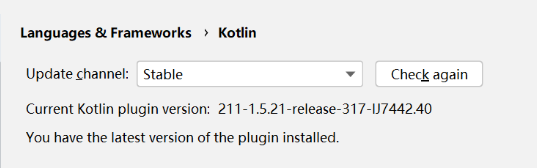

最近项目中引入 OkHttp 4.12.0 后，IDEA 一直报错：

```
cannot resolve symbol 'OkHttpClient'
```

虽然 Maven 已经成功下载依赖，但：

```java
import okhttp3.OkHttpClient;
```

依然全红，无法编译。

## 一、问题环境

| 组件 | 版本 |
|-----|------|
| IDEA | IntelliJ IDEA 2021.1 |
| Kotlin 插件 | 1.5.21 |
| OkHttp | 4.12.0 |
| 构建工具 | Maven |

并且在 Settings → Languages & Frameworks → Kotlin 中显示：

```
You have the latest version of the plugin installed.
```

说明当前 IDEA 已无法升级 Kotlin 插件。



## 二、问题原因

核心原因：

**OkHttp 4.10+ 强制要求 Kotlin 1.8+**

但 IDEA 2021.1 最高只支持：

```
Kotlin 1.5.21
```

因此会导致：

- IDEA 无法解析 OkHttp 类
- OkHttpClient 无法导入
- 代码全部标红

这并不是 Maven 下载失败，而是：

```
IDEA版本过旧 → Kotlin版本过低 → 与OkHttp不兼容
```

## 三、解决方案

### 方案 1：升级 IDEA（推荐）

升级到：

```
IDEA 2023.1+
```

即可正常支持：

- Kotlin 1.8+
- OkHttp 4.12.0

重新导入 Maven 项目后问题会自动消失。

### 方案 2：降级 OkHttp（最快）

如果暂时不升级 IDEA，直接将 OkHttp 降级：

```xml
<dependency>
    <groupId>com.squareup.okhttp3</groupId>
    <artifactId>okhttp</artifactId>
    <version>4.9.3</version>
</dependency>
```

4.9.3 是最后一个兼容 Kotlin 1.5.x 的稳定版本。

修改后重新执行 Maven Reload 即可正常导入：

```java
import okhttp3.OkHttpClient;
```
