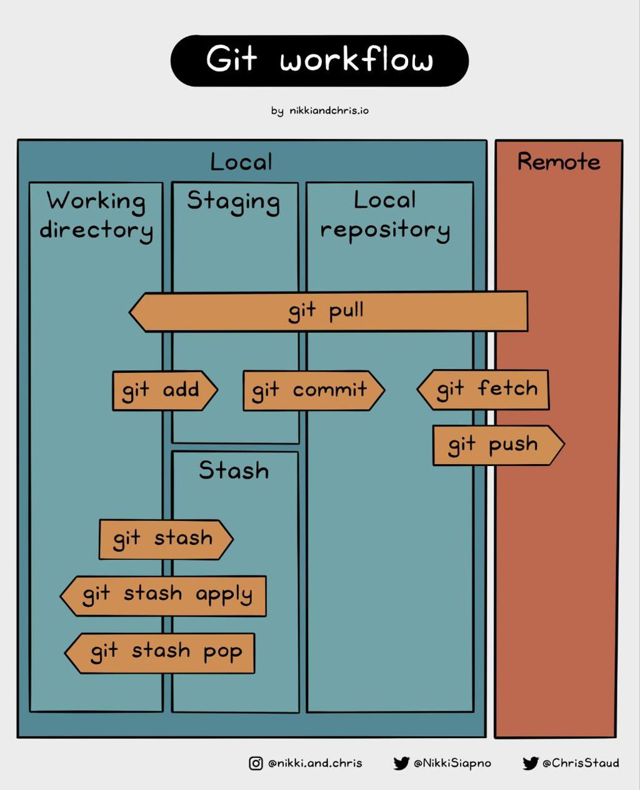

## 1、首先了解下 git workflow 流程



在深入 worktree 之前，我们先回顾 Git 工作流 中最基础的几个区域：

- **暂存区（Staging Area / Index）**：通过 git add 把修改标记为"准备提交"，但此时还没有生成永久快照。
- **临时保存区（Stash）**：通过 git stash 可以把写到一半的半成品临时藏起来，让工作目录回到干净状态。
- **本地仓库（Local repository）**：通过 git commit 将暂存区的内容生成一个永久快照，正式存入本地仓库。

这三个区域构成了日常开发中最常用的工作流骨架。多数情况下，我们都在同一个项目目录里，通过 git checkout 在不同分支间切换，同时靠 stash 来应对中断。

但一旦遇到需要"同时维护两个分支"的场景，传统的 stash + checkout 模式就会暴露出频繁的上下文切换和心智负担。

## 2、一个场景搞清楚 worktree 的作用

假设你正在 main 分支上开发新功能，当前项目目录结构如下：

```
ticket-system/
├── src/
├── pom.xml
└── .git/
```

此时你正在修改 OrderService.java，代码写到一半，还不能提交。突然，线上登录接口挂了，需要在 hotfix 分支紧急修复。领导让你立刻停下新功能，先去修 bug。

### 方案一：传统方式（stash + checkout）

```bash
# 手头代码写了一半，不能 commit，先暂存
git stash

# 切换到 hotfix 分支
git checkout hotfix

# 修改 LoginService.java 修 bug
# ...

git add .
git commit -m "fix login bug"

# 切回 main 分支
git checkout main

# 把刚才写到一半的代码恢复出来
git stash pop
```

整个过程需要暂存、切分支、修复、再切回来，再恢复。一旦 stash 多起来或者忘记 pop，很容易造成混乱。

### 方案二：用 worktree（不 stash，不切分支）

```bash
# main 分支的代码原地保留，不暂存也不切换
# 在 ticket-system 目录外面新建一个 hotfix 工作树，检出 hotfix 分支
git worktree add ../hotfix hotfix
```

执行后，磁盘上会出现两个独立的工作目录，共享同一个 .git 仓库：

- `ticket-system/` → 仍然停留在 main 分支，你的 OrderService.java 草稿原封不动
- `hotfix/` → 已检出 hotfix 分支，专门用来修登录 bug

接下来你可以继续在 ticket-system/ 里写新功能，完全不受影响；同时在新开的 IDE 窗口中打开 hotfix/ 文件夹，修改 LoginService.java：

```bash
cd ../hotfix
# 修改代码 ...
git add .
git commit -m "fix login bug"
```

修复完成后，切回原项目目录继续开发 main：

```bash
cd ../ticket-system
# 继续写 OrderService.java，无需任何 stash/pop 操作
```

最关键的认知转变：

- 以前是一个目录 ticket-system/ + 一个 .git，只能通过 checkout 在分支之间跳来跳去。
- 现在则是多个目录（如 ticket-system/、hotfix/、feature/）共享同一个 .git 仓库，每个目录都像一个独立的工作区，同时存在，互不干扰。

## 3、关于 worktree 的分支占用规则

| 要点 | 说明 |
|-----|------|
| 分支占用规则 | 一个分支（比如 main）默认只能被一个 worktree 占用。如果你尝试让两个 worktree 同时检出同一个分支，Git 会直接报错。 |
| worktree 的真正意义 | 它的设计目标是实现"多个分支并行开发"（比如 main、hotfix、feature 各占一个目录），而不是"把同一个分支复制成多个工作目录"。 |

因此，worktree 解决的并不是同一个分支的多目录副本问题，而是让不同分支的工作可以同时展开，从而彻底消除因为分支切换而产生的等待与中断。

## 4、worktree 在 AI Agent 时代的应用

理解了上述能力后，把视线从单个开发者移到 AI Agent，就会发现一个更契合的使用场景。

在 AI 编程 Agent 逐渐普及的今天，多个 Agent 可能在同一仓库上协同开发不同任务。这时，项目目录不再只是你一个人用，而可以这样划分：

```
project-main/         → Agent A
project-hotfix/       → Agent B
project-refactor/     → Agent C
project-test/         → Agent D
```

例如：

- Agent A → 开发支付功能
- Agent B → 修复线上 bug
- Agent C → 重构 OrderService
- Agent D → 写测试用例

这几个 Agent 可以在各自的工作树里同时进行开发，既不互相阻塞，也不需要 stash 或来回切换分支。它们共享同一个底层仓库，但磁盘上的工作区完全隔离。

git worktree 原本是为了让人类开发者减少上下文切换而设计的。到了 AI Agent 时代，它天然就成了多 Agent 并行编码的基础设施——每一个 Agent 占据一个独立的工作树，在各自分支上安心完成自己的任务，彼此隔离却又基于同一份版本历史协作。
