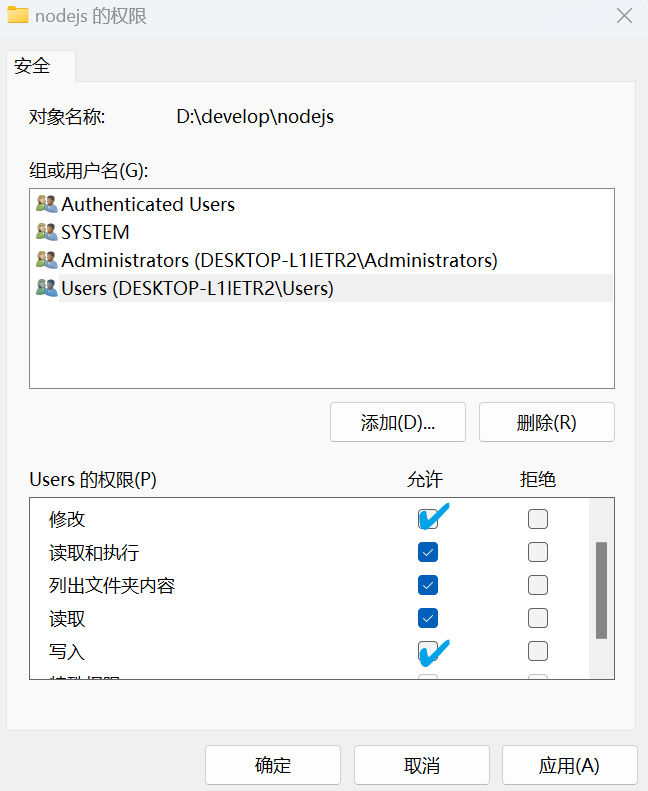

## 问题现象

在 PowerShell 中运行 `claude` 命令时，出现红色警告：

```
✘ Auto-update failed: no write permission to npm prefix · Run /doctor
```

根据提示，执行诊断命令 `/doctor`（即 `claude doctor`），发现 `Updates` 区域明确标记为 **`failed (no_permissions)`**：

```
Updates ⚠
├ Auto-updates: enabled
├ Auto-update channel: latest
├ Last update attempt: failed (no_permissions) — 2026-06-26
├ Stable version: 2.1.181
└ Latest version: 2.1.193
```

这表明自动更新因权限问题而失败。于是手动触发更新：

```powershell
PS C:\Users\31548> claude update 
Current version: 2.1.187 
Checking for updates to latest version... 
New version available: 2.1.193 (current: 2.1.187) 
Installing update... 
Using global installation update method... 
Error: Insufficient permissions to install update 
Try running with sudo or fix npm permissions 
Or consider using native installation with: claude install
```

错误信息明确提示 **权限不足**，无法安装更新。

---

## 问题根源

### 我的 Node.js 安装位置

我的 Node.js 没有安装在默认的 `C:\Program Files\nodejs`，而是安装在了 **`D:\develop\nodejs`**（如果你也自定义了安装路径，请以你的实际路径为准）。

> 💡 默认情况下，Node.js 会安装在 `C:\Program Files\nodejs`，该目录通常需要管理员权限才能写入。而自定义到 D 盘后，权限规则依然严格，同样需要处理。

查看 npm 全局安装目录：

```powershell
npm prefix -g
# 输出：D:\develop\nodejs
```

`claude doctor` 也证实了 Claude Code 的实际安装位置：

```
Path: D:\develop\nodejs\node_modules\@anthropic-ai\claude-code\bin\claude.exe
```

### 为什么"权限不足"？

Windows 操作系统对**非系统盘根目录下的文件夹**（尤其是由管理员账户创建的文件夹）默认会施加较严格的 NTFS 权限。对于 `D:\develop\nodejs`：

- 该目录的**写入权限**默认仅赋予 `Administrators` 组和 `SYSTEM`。
- 我日常使用的是**普通用户**（非管理员）的 PowerShell，对该目录**没有修改权限**。
- 当 `claude update` 试图在 `D:\develop\nodejs\node_modules\@anthropic-ai\claude-code` 中**删除旧版本、写入新版本**时，操作系统拒绝访问，导致更新失败。

---

## 解决方案 1：以管理员身份手动更新（不推荐，无法自动更新）

如果你只是想临时解决一次更新，可以**以管理员身份运行 PowerShell**，然后执行 `claude update`。

### 操作步骤：

1. 关闭当前 PowerShell。
2. 在开始菜单中搜索 "PowerShell"，右键点击，选择 **"以管理员身份运行"**。
3. 在提升权限的窗口中，执行：
   ```powershell
   claude update
   ```
4. 更新完成后，关闭管理员窗口。

### 为什么不推荐？

- **每次更新都需要手动提权**，十分繁琐。
- **无法实现后台自动更新**——Claude Code 的自动更新机制在普通用户权限下依然会因为权限不足而失败，你只能每次都手动干预。
- 长期依赖管理员权限运行会增加安全风险（习惯性提权可能导致误操作）。

因此，如果你希望一劳永逸，请参考下面的**方案 2**。

---

## 解决方案 2：直接授予当前用户写入权限（长效方案）

通过修改 `D:\develop\nodejs` 目录的 NTFS 权限，为当前登录用户添加"修改"和"写入"权限，让普通用户也能正常执行更新操作。

### 操作步骤（图形界面）

1. **打开文件资源管理器**，导航到 `D:\develop\nodejs` 文件夹。

2. **打开属性窗口**  
   右键点击 `nodejs` 文件夹，选择 **"属性"**。

3. **进入安全选项卡**  
   点击 **"安全"** 选项卡，然后点击下方的 **"编辑(E)"** 按钮（修改权限）。

4. **切换用户并勾选权限**  
   在权限列表中，找到并选中 `Users` 组，然后在下方 **"修改"** 和 **"写入"** 对应的"允许"列打勾。  
   如果你希望更彻底，也可以直接勾选 **"完全控制"**（推荐，因为更新时需要删除旧文件，完全控制最省心）。

   

5. **应用并确认**  
   点击"确定"保存。系统会开始应用权限到所有子文件夹和文件（因为 `node_modules` 内文件极多，这个过程可能需要几十秒到一分钟，**请耐心等待**）。

---

## 验证与后续操作

权限修改完成后，**关闭所有普通权限的终端**，重新打开一个**非管理员**的 PowerShell 或 CMD，执行：

```powershell
claude update
```

此时更新流程会正常进行，输出类似：

```
Current version: 2.1.187
Checking for updates to latest version...
New version available: 2.1.193 (current: 2.1.187)
Installing update...
Using global installation update method...
Update successful!
```

版本升级到最新版（如 2.1.193）。

再次运行 `claude doctor`，检查 `Updates` 状态：

```
  Updates ✔
  ├ Auto-updates: enabled
  ├ Auto-update channel: latest
  ├ Last update attempt: succeeded — 2026-06-26
  ├ Stable version: 2.1.181
  └ Latest version: 2.1.193
```

此时 `no_permissions` 已经消失，自动更新功能恢复正常。