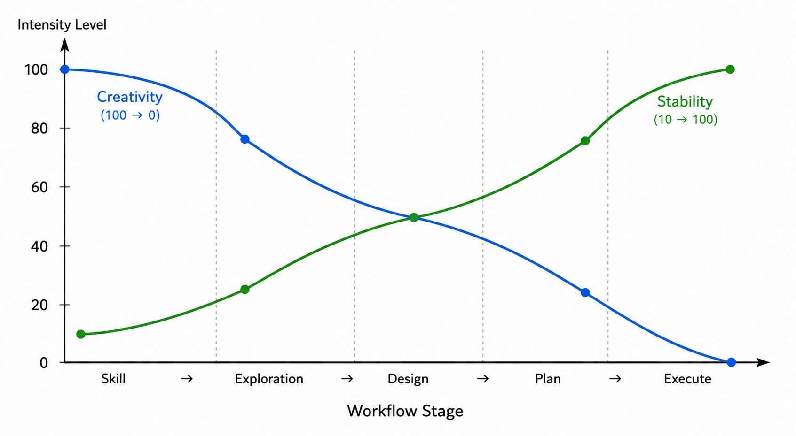

在复杂工程场景下，如果一开始直接让模型进入执行阶段，往往会暴露出一个典型问题：

> 约束越宽松，模型创造力越强，输出越不稳定；约束越严格，创造力越受限，输出越稳定。

例如，你直接对 AI 说"帮我写一个 RAG 系统"。由于约束很少，模型会产生大量可能性。它可能选择：单体架构、微服务架构、Agentic RAG、Hybrid Search、Query Rewrite、MCP Tool Calling、Memory Enhanced Retrieval。看起来很聪明，但问题是结果高度随机，每次输出可能完全不同，工程稳定性极差。

另一种方式，你把 Prompt 写得极其严格：使用 Spring Boot 3.5、使用 PostgreSQL、必须使用 Redis Cache、必须使用 pgvector、采用 MVC 分层结构、按照指定目录生成代码。结果输出稳定了，但 AI 的创造力几乎被抹掉，它退化成高级代码生成器。

如何在 AI 的创造力与工程稳定性之间寻找平衡呢？下面是我逐渐形成的一套工作流。

---

## Skill：封装领域经验，而非执行能力

很多 Agent Framework 里，Skill 被定义为执行能力，例如 `write_code()`、`search_web()`、`generate_image()`。这是一种很自然的理解，在任务自动化场景下也确实有效。不过，我个人更倾向于另一种用法：把 Skill 用来存储 Principles（原则）、Experience（经验）、Methodology（方法论）。

例如，`backend_architecture` 里面存储的是高内聚、低耦合、模块化、接口隔离、事务一致性、可扩展性。`bilibili_thumbnail_design` 里面存储的是标题主体、低信息密度、用户视角、缩略图可读性、点击率优先。

Skill 不再优先承担执行功能，而更像是一种领域认知的载体。

这种方式的优势在于，它为 AI 提供了明确的认知边界，同时保留足够的探索空间。一套标准可以跨场景复用，使模型更多依赖自身知识进行判断，而不是机械执行固定指令。某种程度上，它更接近人类专家基于经验和方法论进行决策的过程。

这种工作方式的核心并不是告诉 AI："应该怎么做"。而是先告诉 AI："什么才是好的结果"。

---

## Exploration：AI 发散可能路径，人类持续参与决策

当需求提出后，先加载对应领域的 Skill，然后进入方案探索阶段（Exploration）。注意，这里不是让 AI 直接执行，而是先基于现有上下文，在既定边界内生成多种可行方案。

例如，我说"我要做一个浏览器插件"，AI 可以瞬间生成：

- 方案 A：Popup 驱动
- 方案 B：Content Script 注入
- 方案 C：Side Panel 方案
- 方案 D：Background Worker 持续监听

但这只是第一步。接下来，人类通过持续提问、选择和引导，不断缩小解空间：

- 维护成本如何？
- 开发周期多久？
- 个人开发是否合适？
- 是否方便后续扩展？

每一轮问答都在帮助 AI 更精准地接收新的约束，并逐步过滤掉不合适的选项。

AI 负责生成可能性，人类负责持续收紧边界，两者反复交替，方案空间逐步收窄。

从某种意义上说，AI 在这里并不是执行者，而更像一个高速的"可能性生成器"。

---

## Design：人类主导决策，逐步确定方向

经过多轮探索和筛选，Design 逐渐成型。

整个流程变成：

> 模糊需求 → Skill 加载领域经验 → 方案探索（Exploration）→ 多轮人工筛选与提问 → Design

Design 不应该是需求的直接翻译，而应该是探索、权衡与选择之后自然形成的结果。很多时候，用户自己一开始也并不知道最佳方案是什么，只有在与 AI 的交互中，通过不断对比和权衡，方向才逐步清晰。

这个阶段，人类始终掌握决策权。每一步选择都基于人类对业务目标、资源限制、团队能力的判断——这些是 AI 无法获取的上下文。

---

## Plan & Execute：从设计到确定性执行

Design 被确定后，开放式探索基本结束。接下来将 Design 转化为 Plan，即具体执行路径，例如：创建数据库 → 创建 Entity → 创建 Service → 创建 API → 编写测试。

计划确定后，进入 Execute 阶段，按计划逐项执行。此时创造性探索已经基本完成，在很多情况下，可以逐步切换到成本更低、偏执行导向的模型，例如 GPT mini、Qwen、Claude Haiku、本地模型。

---

## 总结

AI 擅长扩展解空间，工程的本质却是不断收敛解空间。真正高效的 AI 工作流，不是让 AI 一开始就直接执行，而是在不同阶段动态调整创造力与约束的比例。

这个过程可以概括为：

> Skill → Exploration → Design → Plan → Execute

前期充分释放 AI 的发散能力，让它在既定原则边界内生成大量可能路径；后期逐步增强约束，将方案收敛为确定性的执行步骤。于是有了这样的变化曲线：

创造力与稳定性不是二选一，而是随着工程推进不断调整权重。关键在于把 AI 最强的一面用在它最擅长的地方，而不是一开始就把它锁死。

我越来越觉得，在 AI 时代，开发者的价值重心可能正在发生变化。除了具体实现能力之外，定义原则、组织 Skill、引导方案探索、选择技术路线、持续收紧约束，正在变得越来越重要。 **真正的工程能力，从来不只是执行得更快，而是更早找到正确的方向。**